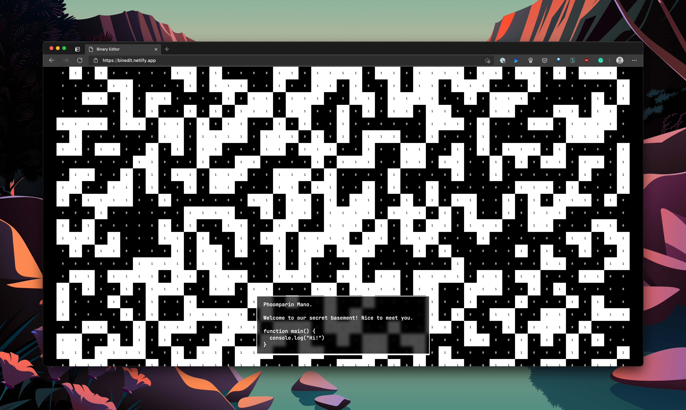
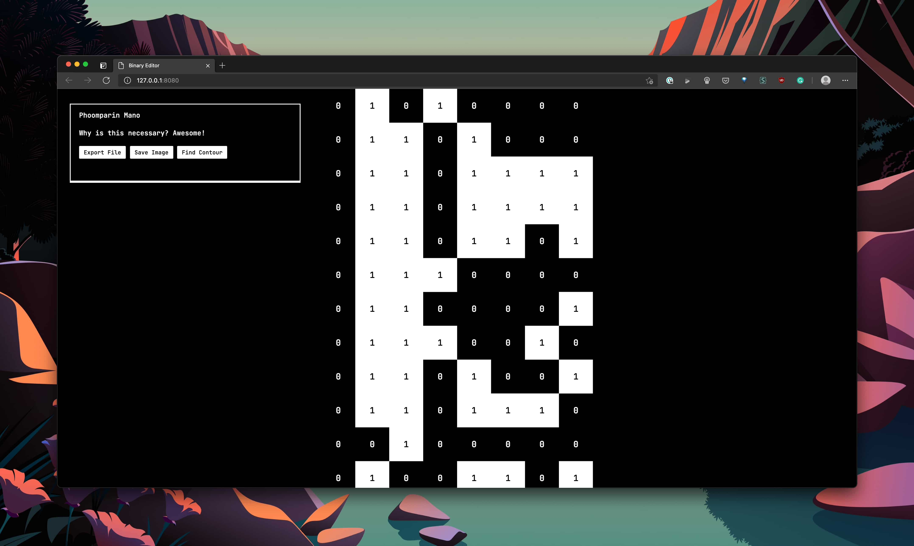

# Visual Binary Editor: Because Hex is Overrated

This is a visual binary editor that allows you to edit files in binary! Not in Hex, in **binary**. Real zeros and ones.

Try it here: https://visualbin.netlify.app

## Key Features

### Basic Editing

- Drag and drop files into the app to edit.
- Type "0" and "1" to append 0 and 1 bits.
- Click on a tile to flip the bits. (i.e. from 0 to 1, and vice-versa.)
- Backspace deletes the last bit, while SHIFT + Backspace deletes 8 bits (i.e. a byte)
- Type any alphanumeric characters aside from 0 and 1 to insert them as binary. For instance, "P" insert 01010000, so you can input text directly.
- Your buffer is automatically written to the localStorage on every edit.

### Keybindings

- CTRL + E toggles between 8-bit view and the tile view. The 8-bit view shows 8 bits per row, so it's easier to edit. The tile

- CTRL + H toggles the number in the tile. You can turn it off to make it look nicer.

- CTRL + P toggles the action panel for ASCII preview, File Export, Image Export and Find Countour

- CTRL + N clears the current buffer.

## Action Panel

- The preview panel shows the ASCII representation of the current file.

- "Export File" button exports the current buffer as a binary file. Click on the URL to download.

- "Export Image" button exports the visual preview as an image. See more on Pattern Steganography section.

- "Find Countour" button uses OpenCV to trace the tile into nice-looking corners.

## Pattern Steganography

Click on "Export Image" to export a pattern image, where you can send to your friend to decode. Click on the URL to download the image.

Drop the exported PNG file to decode to the current buffer. Here is an example of the exported pattern -- try to drop it into the editor!

